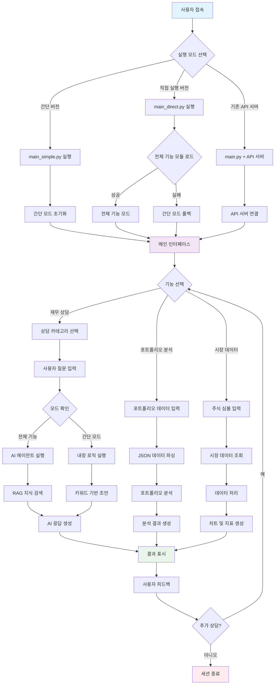
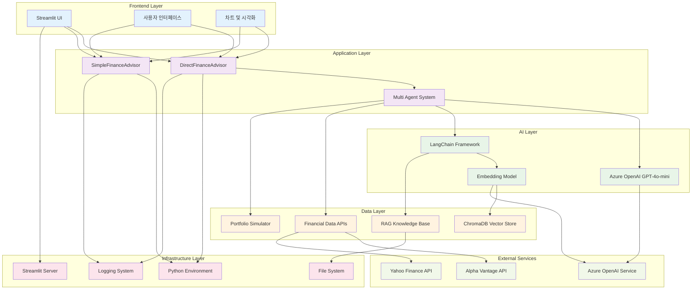
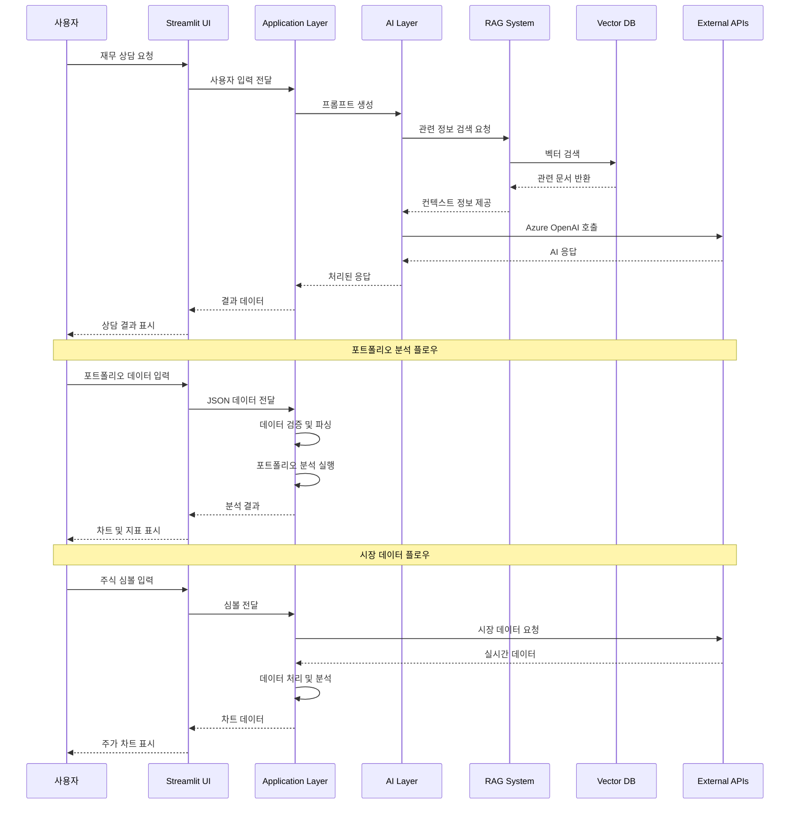

# 🏗️ AI 재무관리 어드바이저 - 아키텍처 문서

## 📋 목차
1. [사용자 플로우 다이어그램](#사용자-플로우-다이어그램)
2. [서비스 아키텍처 다이어그램](#서비스-아키텍처-다이어그램)
3. [시스템 구성 요소](#시스템-구성-요소)
4. [데이터 플로우](#데이터-플로우)

---

## 🎯 사용자 플로우 다이어그램



### 🔄 사용자 플로우 설명

#### 1. **초기 접속 단계**
- 사용자가 Streamlit 실행 버튼 클릭
- 3가지 실행 모드 중 선택 (간단/직접/API 서버)

#### 2. **시스템 초기화 단계**
- **간단 버전**: 즉시 사용 가능한 내장 로직 로드
- **직접 실행**: 전체 기능 모듈 로드 시도 → 실패 시 간단 모드 폴백
- **API 서버**: FastAPI 서버 연결 및 상태 확인

#### 3. **기능 선택 단계**
- 재무 상담, 포트폴리오 분석, 시장 데이터 중 선택
- 각 기능별 맞춤형 입력 인터페이스 제공

#### 4. **데이터 처리 단계**
- **전체 기능 모드**: AI 에이전트 + RAG 지식 검색
- **간단 모드**: 키워드 기반 내장 로직
- **포트폴리오**: JSON 파싱 및 분석 알고리즘
- **시장 데이터**: 실시간/모의 데이터 처리

#### 5. **결과 표시 단계**
- 구조화된 응답, 차트, 지표를 통합 표시
- 사용자 피드백 수집 및 추가 상담 지원

---

## 🏛️ 서비스 아키텍처 다이어그램



### 🏗️ 아키텍처 구성 요소

#### **Frontend Layer (프론트엔드 계층)**
- **Streamlit UI**: 사용자 인터페이스 및 상호작용
- **차트 및 시각화**: Plotly 기반 인터랙티브 차트
- **반응형 디자인**: 다양한 화면 크기에 대응

#### **Application Layer (애플리케이션 계층)**
- **DirectFinanceAdvisor**: 전체 기능 통합 관리자
- **SimpleFinanceAdvisor**: 간단 모드 전용 관리자
- **Multi Agent System**: 전문 에이전트들 (예산/투자/세무/퇴직)

#### **AI Layer (AI 계층)**
- **Azure OpenAI GPT-4o-mini**: 메인 LLM 모델
- **LangChain Framework**: AI 워크플로우 관리
- **Embedding Model**: 텍스트 벡터화 (text-embedding-3-small)

#### **Data Layer (데이터 계층)**
- **RAG Knowledge Base**: 금융 지식 문서 저장소
- **ChromaDB Vector Store**: 벡터 데이터베이스
- **Financial Data APIs**: 실시간 시장 데이터
- **Portfolio Simulator**: 포트폴리오 분석 엔진

#### **Infrastructure Layer (인프라 계층)**
- **Python Environment**: 실행 환경
- **Streamlit Server**: 웹 서버
- **File System**: 로그 및 데이터 저장
- **Logging System**: 시스템 모니터링

#### **External Services (외부 서비스)**
- **Alpha Vantage API**: 주식 시장 데이터
- **Yahoo Finance API**: 금융 정보
- **Azure OpenAI Service**: AI 모델 서비스

---

## 🔧 시스템 구성 요소

### **1. 핵심 모듈**
```
src/
├── agents/           # AI 에이전트 시스템
│   ├── budget_agent.py
│   ├── investment_agent.py
│   ├── tax_agent.py
│   ├── retirement_agent.py
│   └── multi_agent_system.py
├── core/            # 핵심 기능
│   ├── config.py
│   ├── financial_data.py
│   ├── portfolio_simulator.py
│   └── advanced_ai.py
├── rag/             # RAG 시스템
│   ├── knowledge_base.py
│   ├── document_processor.py
│   └── vector_store.py
└── api/             # API 서버
    └── main.py
```

### **2. 실행 파일**
```
├── main.py              # 기존 API 서버 방식
├── main_direct.py       # 직접 실행 버전
├── main_simple.py       # 간단 버전
├── start_direct.bat     # 직접 실행 배치
└── start_simple.bat     # 간단 실행 배치
```

---

## 📊 데이터 플로우



### 🔄 데이터 플로우 설명

#### **1. 재무 상담 플로우**
1. 사용자 질문 입력
2. 프롬프트 생성 및 RAG 검색
3. Azure OpenAI API 호출
4. 응답 처리 및 구조화
5. 결과 표시

#### **2. 포트폴리오 분석 플로우**
1. JSON 데이터 입력 및 검증
2. 자산 배분 계산
3. 리스크 평가
4. 시각화 데이터 생성
5. 차트 및 지표 표시

#### **3. 시장 데이터 플로우**
1. 주식 심볼 입력
2. 외부 API 호출 (실시간/모의)
3. 데이터 정제 및 분석
4. 차트 생성
5. 결과 표시

---

## 🎯 주요 특징

### **✅ 장점**
- **모듈화된 설계**: 각 기능이 독립적으로 개발 및 유지보수 가능
- **확장성**: 새로운 에이전트나 기능 추가 용이
- **호환성**: 다양한 환경에서 실행 가능
- **안정성**: 오류 발생 시 자동 폴백 메커니즘

### **🔧 기술적 특징**
- **하이브리드 아키텍처**: 전체 기능 + 간단 모드 이중 구조
- **RAG 통합**: 정확한 정보 제공을 위한 지식베이스 활용
- **실시간 처리**: 사용자 입력에 대한 즉시 응답
- **시각화**: 인터랙티브 차트 및 대시보드

이 아키텍처를 통해 사용자는 안정적이고 정확한 재무 상담 서비스를 24/7 이용할 수 있습니다.
