# 🏗️ AI 재무관리 어드바이저 - 아키텍처 다이어그램 문서

## 📋 목차
1. [사용자 플로우 다이어그램](#사용자-플로우-다이어그램)
2. [서비스 아키텍처 다이어그램](#서비스-아키텍처-다이어그램)
3. [시스템 구성 요소 다이어그램](#시스템-구성-요소-다이어그램)
4. [데이터 플로우 다이어그램](#데이터-플로우-다이어그램)
5. [기능별 처리 방식 다이어그램](#기능별-처리-방식-다이어그램)

---

## 🎯 사용자 플로우 다이어그램

### **전체 사용자 경험 플로우**

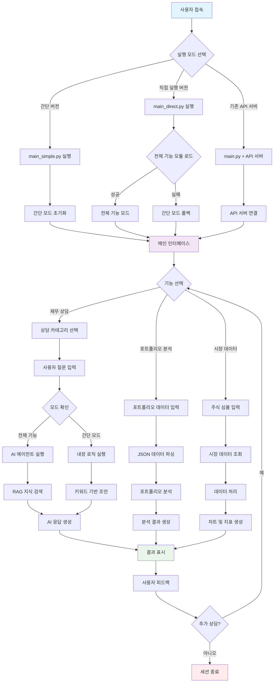

### **실행 모드별 특징 비교**

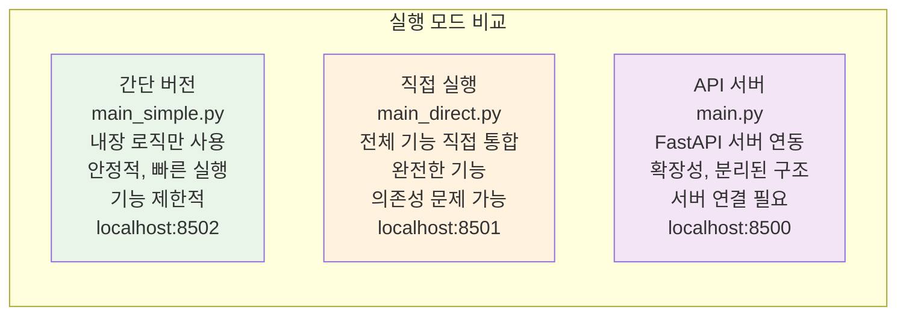

---

## 🏛️ 서비스 아키텍처 다이어그램

### **전체 시스템 아키텍처**

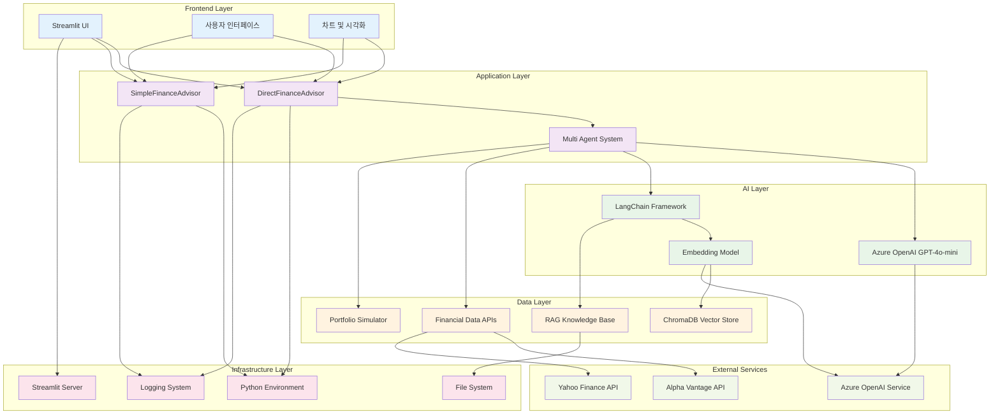

### **계층간 데이터 흐름**

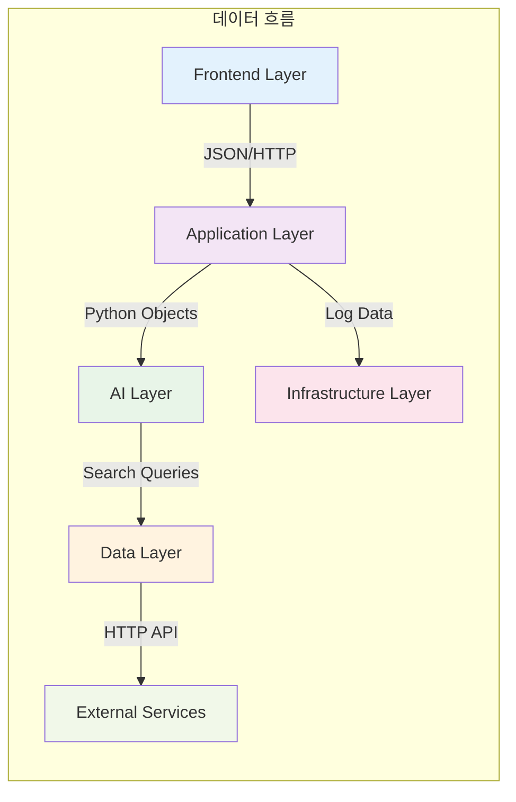

---

## 🔧 시스템 구성 요소 다이어그램

### **핵심 모듈 구조**

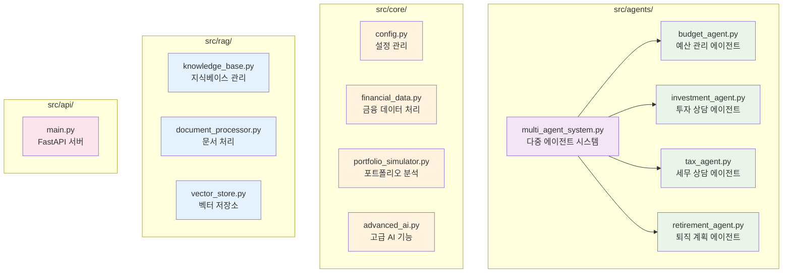

### **실행 파일 구성**

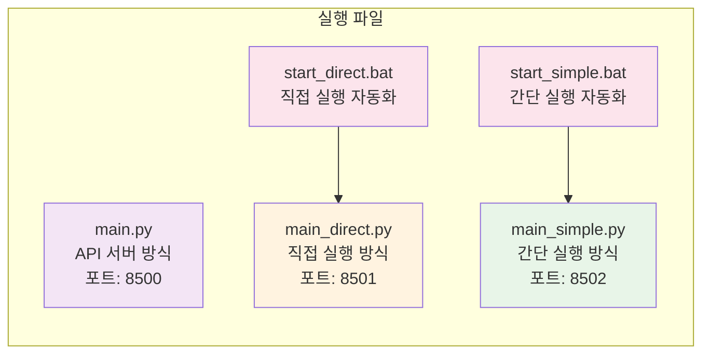

---

## 📊 데이터 플로우 다이어그램

### **재무 상담 데이터 플로우**

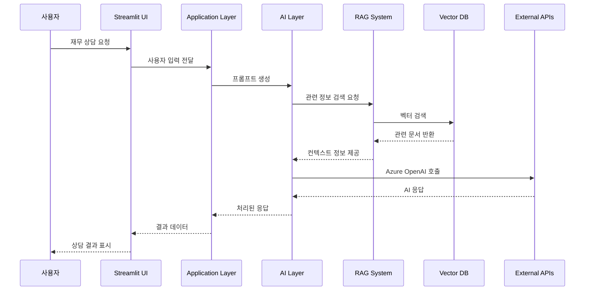

### **포트폴리오 분석 데이터 플로우**

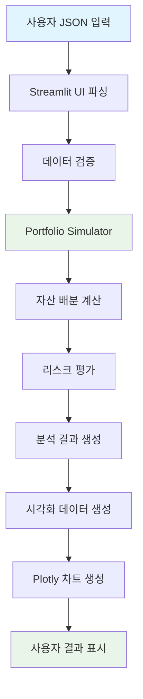

### **시장 데이터 플로우**

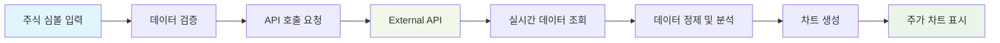

---

## 🎯 기능별 처리 방식 다이어그램

### **모드별 기능 처리 방식**

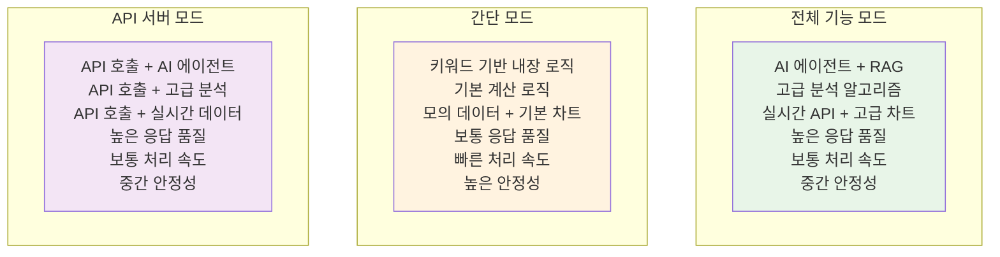

### **에이전트별 전문 분야**

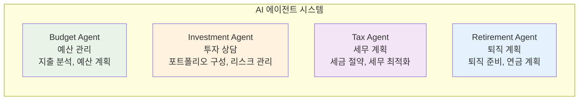

### **기술 스택별 역할**

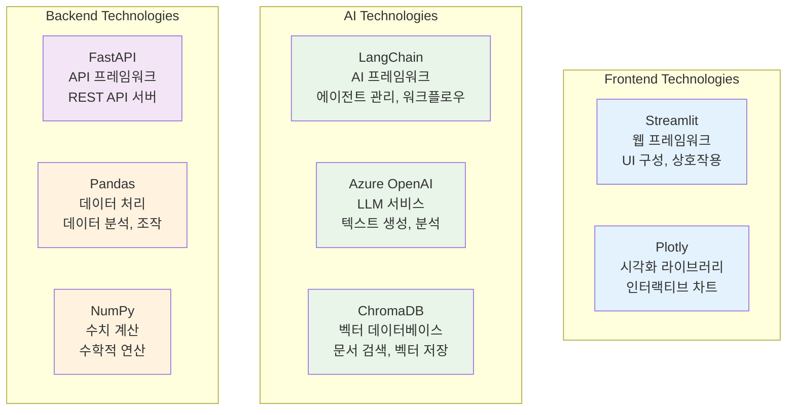

---

## 🎯 주요 특징 다이어그램

### **시스템 장점**

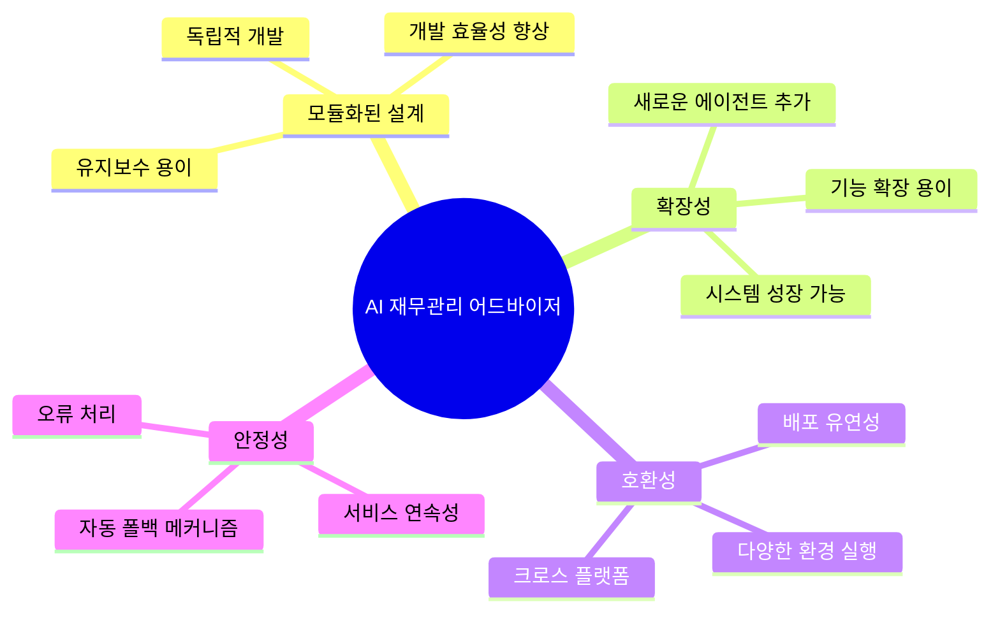

### **기술적 특징**

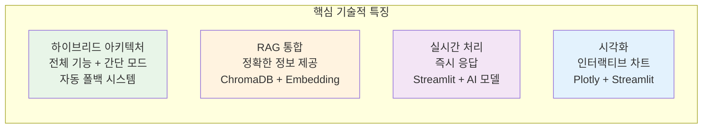

---

## 📋 요약 표

### **실행 모드별 특징**

| 실행 모드 | 파일명 | 특징 | 장점 | 단점 | 접속 URL |
|-----------|--------|------|------|------|----------|
| **간단 버전** | `main_simple.py` | 내장 로직만 사용 | 안정적, 빠른 실행 | 기능 제한적 | `http://localhost:8502` |
| **직접 실행** | `main_direct.py` | 전체 기능 직접 통합 | 완전한 기능 | 의존성 문제 가능 | `http://localhost:8501` |
| **API 서버** | `main.py` | FastAPI 서버 연동 | 확장성, 분리된 구조 | 서버 연결 필요 | `http://localhost:8500` |

### **에이전트별 전문 분야**

| 에이전트 | 전문 분야 | 주요 기능 | 입력 데이터 | 출력 결과 |
|----------|-----------|-----------|-------------|-----------|
| **Budget Agent** | 예산 관리 | 지출 분석, 예산 계획 | 수입/지출 데이터 | 예산 권장사항 |
| **Investment Agent** | 투자 상담 | 포트폴리오 구성, 리스크 관리 | 투자 목표, 위험 성향 | 투자 전략 |
| **Tax Agent** | 세무 계획 | 세금 절약, 세무 최적화 | 소득, 지출 정보 | 세무 계획 |
| **Retirement Agent** | 퇴직 계획 | 퇴직 준비, 연금 계획 | 나이, 소득, 목표 | 퇴직 전략 |

이 다이어그램 문서를 통해 AI 재무관리 어드바이저의 전체 구조와 동작 방식을 시각적으로 이해할 수 있습니다.
